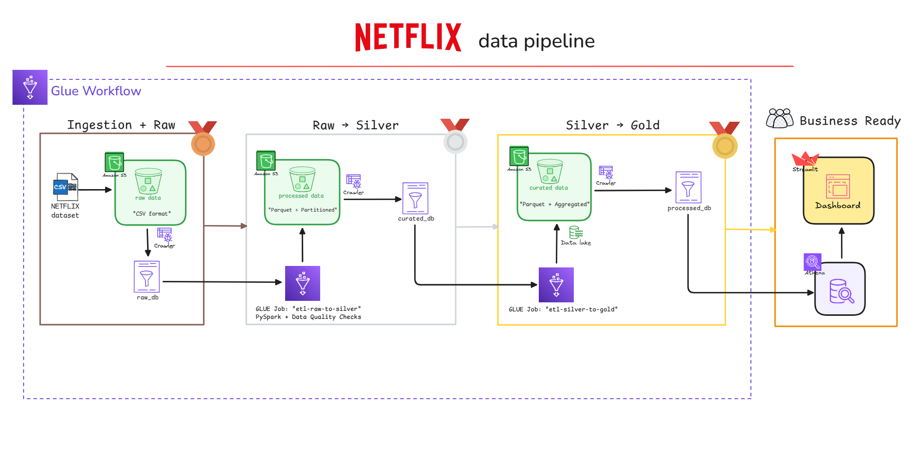

<div align="center">

# 🍿 Netflix Lakehouse Analytics Pipeline

A production-style Lakehouse analytics platform built using AWS Glue, PySpark, and Athena.
Designed to demonstrate end-to-end data engineering skills: ingestion, transformation,
data quality checks, and analytics consumption via Streamlit.


Live Netflix Analytics Dashboard here: [https://netflix-data-insights.streamlit.app/](https://netflix-data-insights.streamlit.app/)

</div>

---

## 📋 Table of Contents

- [Overview](#-overview)
- [Architecture](#️-architecture)
- [Key Features](#-key-features)
- [Tech Stack](#️-tech-stack)
- [Project Structure](#-project-structure)
- [Data Pipeline Flow](#-data-pipeline-flow)
- [Results & Achievements](#-results--achievements)
- [Key Learnings](#-key-learnings)
- [Setup & Usage](#-setup--usage)
- [Documentation](#-documentation)
- [License](#-license)
- [Acknowledgments](#-acknowledgments)

---

## 🎯 Overview

Scalable data pipeline processing **8,807 Netflix titles** through Bronze-Silver-Gold layers, delivering automated analytics dashboards and data quality monitoring for content strategy insights.

**Business Impact:**

- 📊 Real-time content distribution tracking across genres, countries, and ratings
- 🔍 Automated data quality validation with **95.7%** high-quality record achievement
- 📈 Temporal trend analysis for strategic content acquisition planning
- 💰 **70%** storage optimization via Parquet compression

**Dataset:** [Kaggle Netflix Shows](https://www.kaggle.com/shivamb/netflix-shows) | 12 attributes | 2008-2021 coverage

## 🏗️ Architecture


<div align="center"></div>


### Medallion Architecture Layers

```bash
┌─────────────────────────────────────────────────────────────────────────┐
│                           NETFLIX DATA PIPELINE                         │
└─────────────────────────────────────────────────────────────────────────┘

┌──────────────┐       ┌──────────────┐       ┌──────────────┐
│   🥉 BRONZE  │  ───▶ │   🥈 SILVER  │  ───▶ │   🥇 GOLD    │
│   Raw Data   │       │  Cleansed    │       │  Business    │
│              │       │  Enriched    │       │  Ready       │
└──────────────┘       └──────────────┘       └──────────────┘
   S3 raw/            S3 processed/               S3 curated/
   CSV Format         Parquet Format              Parquet Format
                      (Partitioned)               (Aggregated)
```

### Pipeline Components

| Component | Technology | Purpose |
|-----------|-----------|---------|
| **Data Lake** | Amazon S3 | Scalable storage for all data layers |
| **ETL Engine** | AWS Glue (PySpark) | Distributed data transformations |
| **Data Catalog** | AWS Glue Crawlers | Automated schema discovery and metadata management |
| **Query Engine** | Amazon Athena | Serverless SQL analytics |
| **Orchestration** | AWS Glue Workflows | Job scheduling and dependency management |
| **Visualization** | Streamlit | Interactive business dashboards |

---

## ✨ Key Features

### Data Quality Framework

- **Validation Engine:** Primary key checks, mandatory field validation, quality scoring (0.0-1.0)
- **Rejection Handling:** Automated invalid record isolation with audit trails
- **Quality Tiers:** High (≥0.8), Medium (0.5-0.8), Low (<0.5) classification

### Intelligent Transformations

- **Feature Engineering:** 10+ derived attributes (content_age, quality_flags, primary_genre)
- **Data Cleansing:** Multi-format date parsing, duration extraction, null standardization
- **Deduplication:** Show_id based with audit tracking

### Performance Optimization

- **Storage:** Parquet with Snappy compression (70% reduction)
- **Partitioning:** Content_type based for optimized query performance
- **Processing:** PySpark distributed execution with adaptive query optimization

### Analytics Layer

**7 Gold Tables:** Genre Analysis | Geographic Distribution | Temporal Trends | Rating Metrics | Quality Scorecard | Top Producers | Content Summary

---

## 🛠️ Tech Stack

| Layer | Technology | Purpose |
|-------|-----------|---------|
| **Storage** | Amazon S3 | Scalable data lake (Bronze/Silver/Gold) |
| **ETL** | AWS Glue + PySpark 3.x | Serverless distributed transformations |
| **Catalog** | AWS Glue Crawlers | Automated schema discovery |
| **Query** | Amazon Athena | Serverless SQL analytics |
| **Orchestration** | AWS Glue Workflows | Job scheduling & dependencies |
| **Visualization** | Streamlit + Pandas | Interactive dashboards |
| **Security** | AWS IAM | Role-based access control |

**Data Formats:** CSV (Bronze) → Parquet/Snappy (Silver/Gold)

---

## 📁 Project Structure

```bash
NETFLIX-ANALYTICS-PIPELINE/
│
├── 📂 data/                             # Sample datasets (not committed to Git)
│   ├── netflix_titles.csv               # Raw data (Bronze)
│   ├── netflix_bronze_raw.csv           # Bronze layer sample
│   ├── netflix_silver_processed.csv     # Silver layer sample
│   └── netflix_gold_*.csv               # Gold layer samples (7 tables)
│
├── 📂 scripts/                           # ETL scripts
│   ├── netflix-raw-to-processed.py       # Bronze → Silver transformation
│   ├── adhoc_pandas_tansformation.py     # Adhoc pandas transformations for testing
│   └── netflix_silver_to_gold_etl.py     # Silver → Gold aggregations
│
├── 📂 streamlit_app/                 # Visualization dashboard
│   ├── pages/                        # Multi-pages of dashboard
│   ├── utils/                        # Helper functions
│   ├── Home.py                       # Main dashboard page
│   └── config.py                     # App configuration
│
├── 📂 config/                         # Configuration files
│   ├── glue_job_config.json           # Glue job parameters
│   └── s3_bucket_structure.json       # S3 folder hierarchy
│
├── 📂 docs/                           # Documentation
│   ├── architecture.md                # Detailed architecture docs
│   ├── setup_guide.md                 # Step-by-step setup instructions
│   └── data_dictionary.md             # Schema documentation
│
├── 📂 assets/                           # Images and diagrams
│   ├── architecture_diagram.png         # Pipeline architecture
│   ├── dashboard_screenshots/           # Dashboard previews
│   ├── Netflix_Logo_RGB.png             # Netflix logo for dashboards
│   └── Netflix_Symbol_RGB.png           # Netflix symbol for dashboards
│
├── 📄 README.md                      # Project overview (this file)
├── 📄 requirements.txt               # Python dependencies
├── 📄 .gitignore                     # Git ignore rules
├── 📄 .python-version                # Python Version
└── 📄 LICENSE                        # MIT License
```

---

## 🔄 Data Pipeline Flow

### Bronze → Silver (`netflix-raw-to-processed.py`)

```python
Input: netflix_titles.csv (8,807 records)
Transformations:
  ├── Schema validation & rejection handling
  ├── Null standardization (6 columns)
  ├── Date parsing with multi-format support
  ├── Duration extraction (minutes/seasons)
  ├── Feature engineering (added_year, content_age, quality_score)
  └── Deduplication by show_id
Output: Partitioned Parquet (by content_type)
Processing Time: ~3-4 minutes
```

Refer the full code in `scripts/netflix-raw-to-processed.py` for detailed transformations and data quality checks.

### Silver → Gold (`netflix_silver_to_gold_etl.py`)

```python
Input: netflix_silver_processed (validated records)
Aggregations:
  ├── Genre performance metrics
  ├── Country-wise distribution
  ├── Monthly addition trends
  ├── Rating distribution
  ├── Quality scorecards
  ├── Top producer analytics
  └── Content type summaries
Output: 7 business-ready tables
Processing Time: ~2-3 minutes
```

Refer the full code in `scripts/netflix_silver_to_gold_etl.py` for detailed aggregation logic and Gold table definitions.

---

## 🎯 Results & Achievements

### Performance Metrics

| Metric | Achievement |
|--------|------------|
| **Data Quality** | 95.7% high-quality records (score ≥ 0.8) |
| **Processing Speed** | End-to-end pipeline: 5-7 minutes |
| **Storage Efficiency** | 70% compression with Parquet |
| **Cost** | ~$15-20/month (AWS free tier optimized) |

### Business Insights

- **Content Mix:** 69.6% Movies, 30.4% TV Shows
- **Global Reach:** 106 countries represented
- **Genre Leadership:** Drama (26.1%), Comedy (14.8%), Action (11.2%)
- **Trend Peak:** Q4 shows highest content additions (holiday strategy)

### Technical Accomplishments

✅ Production-grade Medallion Architecture implementation  
✅ Automated schema discovery & metadata management  
✅ Scalable partition strategy for query optimization  
✅ Reusable PySpark transformation framework  
✅ Interactive BI dashboards with real-time updates

---

## 💡 Key Learnings

### ***Challenges Solved:***

1. **Schema Inference:** Resolved CSV parsing errors via explicit StructType definitions
2. **Date Parsing:** Handled multiple formats using coalesce() with pattern matching
3. **Memory Optimization:** Scaled from 2→5 DPU + partitioning strategy
4. **Data Quality:** Built comprehensive validation with rejection workflows

### ***Technical Growth:***

- Mastered Medallion Architecture principles
- PySpark optimization (broadcast joins, caching, partition pruning)
- AWS Glue serverless ETL best practices
- Parquet columnar storage for analytics workloads

---

## 🚀 Setup & Usage

### Prerequisites

```bash
AWS Account with S3, Glue, Athena permissions
Python 3.12+ with PySpark, Streamlit, uv, pip
AWS CLI configured
```

### Quick Start

```bash
# Clone repository
git clone https://github.com/k3XD16/netflix-lakehouse-analytics-pipeline

# Install dependencies
pip install -r requirements.txt

# Configure AWS
aws configure

# Run Streamlit dashboard
cd streamlit_app
streamlit run Home.py
```

### Sample Queries (Athena)

```sql
-- Top genres by content volume
SELECT primary_genre, SUM(content_count) as total
FROM netflix_curated_db.netflix_gold_genre_analysis
GROUP BY primary_genre
ORDER BY total DESC LIMIT 10;

-- Quality distribution
SELECT quality_tier, COUNT(*) as records
FROM netflix_curated_db.netflix_gold_quality_scorecard
GROUP BY quality_tier;
```

---

## 📚 Documentation

- [Architecture Documentation](docs/architecture.md) - Deep dive into design decisions
- [Data Dictionary](docs/data_dictionary.md) - Complete schema documentation
- [Glue Workflow](docs/glue_workflow.md) - Workflow orchestration details
- [Setup Guide](docs/setup_guide.md) - Detailed step-by-step instructions

## 📄 License

This project is licensed under the MIT License - see the [LICENSE](LICENSE) file for details.


## 🙏 Acknowledgments

- **Dataset**: [Kaggle - Netflix Movies and TV Shows](https://www.kaggle.com/shivamb/netflix-shows)
- **Inspiration**: AWS Big Data Blog and Databricks Medallion Architecture
- **Tools**: AWS Glue, PySpark, Streamlit communities

---

<div align="center">

### ⭐ If you found this project helpful, please give it a star!

**Built with ❤️ by [Mohamed Khasim](https://x.com/k3XD16)**


</div>
